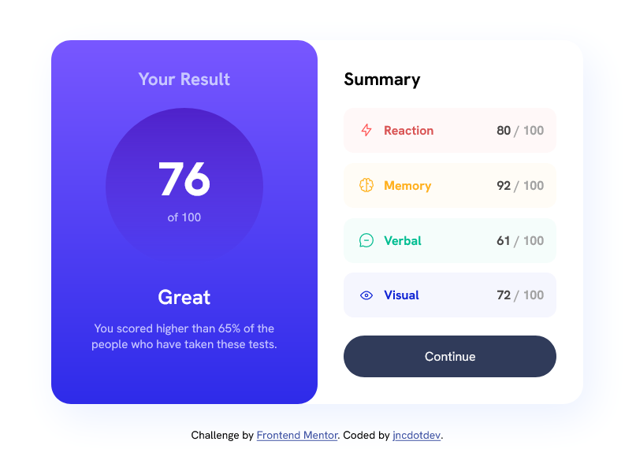
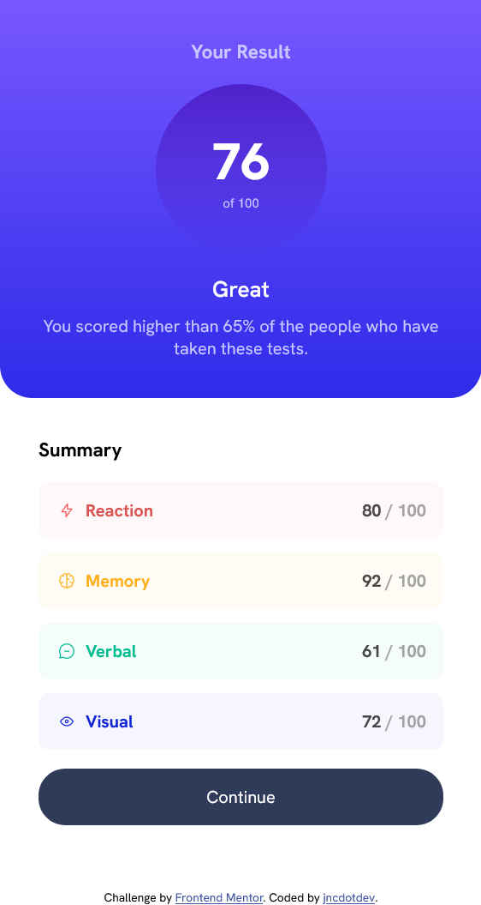

# Frontend Mentor - Results summary component solution

This is a solution to the [Results summary component challenge on Frontend Mentor](https://www.frontendmentor.io/challenges/results-summary-component-CE_K6s0maV). Frontend Mentor challenges help you improve your coding skills by building realistic projects. 

## Table of contents
  - [The challenge](#the-challenge)
  - [Screenshot](#screenshot)
  - [Built with](#built-with)
  - [What I learned](#what-i-learned)
  - [Continued development](#continued-development)
  - [Author](#author)
  - [Acknowledgments](#acknowledgments)


### The challenge

Users should be able to:

- View the optimal layout for the interface depending on their device's screen size
- See hover and focus states for all interactive elements on the page
- **Bonus**: Use the local JSON data to dynamically populate the content

### Screenshot





### Built with

- Semantic HTML5 markup
- CSS custom properties
- Flexbox

### What I learned

I learnt about adding using font-face in CSS and alos adding favicon to a site

To see how you can add code snippets, see below:

```html
<link rel="icon" type="image/png" sizes="32x32" href="./assets/images/favicon-32x32.png">
```
```css
@font-face {
    font-family: "HankenGrotesk";
    src: url(./assets/fonts/HankenGrotesk-VariableFont_wght.ttf);
}
```


### Continued development

Hopefully, one day, I'll add a form first which will be filled with the scores data and saved as a JSON file. The file will then be used in the result summary component


## Author

- Github - [NC-Joey](https://www.github.com/NC-Joey)
- Frontend Mentor - [@NC-Joey](https://www.frontendmentor.io/profile/NC-Joey)
- X - [@jnc_dev](https://x.com/jnc_dev)


## Acknowledgments
I appreciate Frontend Mentor for this challenge which helped improve my frontend skills. Kevin Powell for his lessons on responsive approach to web design

